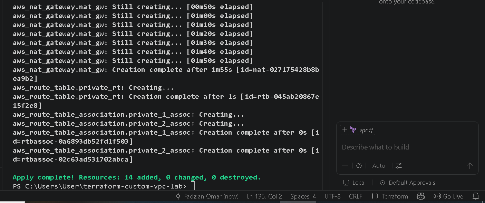
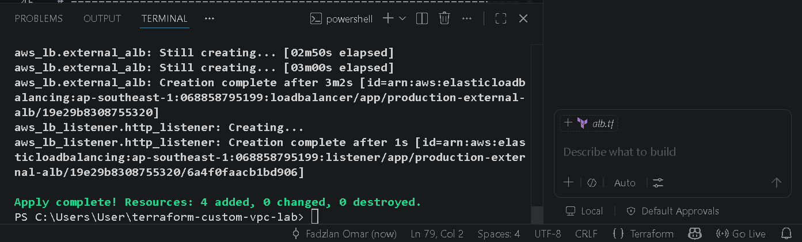
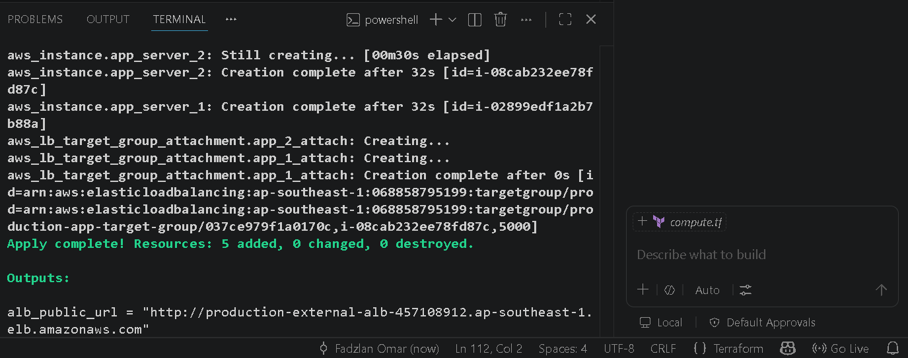
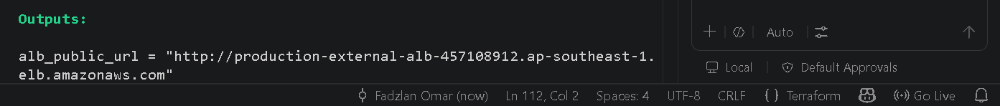
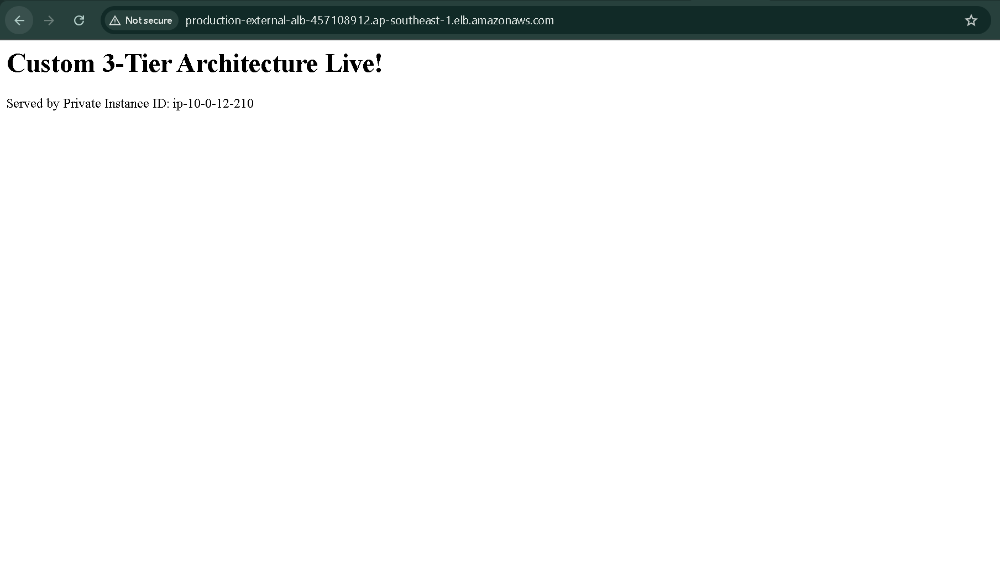
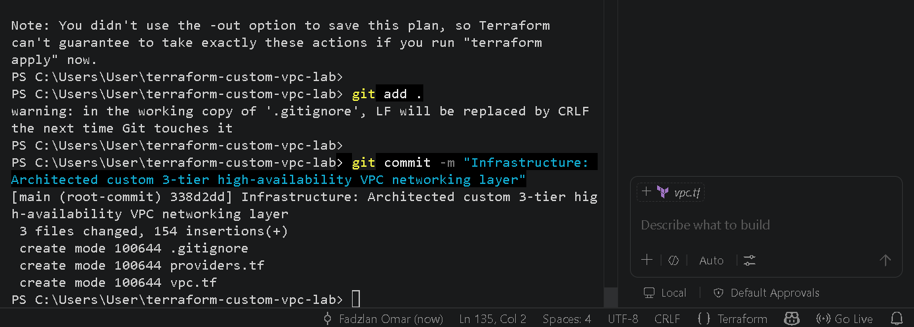
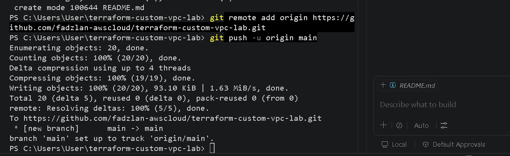

# Project of High-Availability Custom Three-Tier Network Architecture (AWS VPC From Scratch)

A production-grade, enterprise-ready AWS network infrastructure engineered entirely from scratch using Terraform. This architecture completely moves away from AWS default VPC settings to demonstrate a deep, hands-on understanding of advanced networking concepts, asymmetric routing, Layer-4 firewalls, and Layer-7 application load balancing.

---

## Core Architectural Schematic Diagram

The entire network fabric is deployed across multiple Availability Zones in the **ap-southeast-1 (Singapore)** region to ensure high availability and absolute fault tolerance.

```
                  [ PUBLIC INTERNET ]
                           │
                           ▼
                 [ Internet Gateway ]
                           │
 ┌─────────────────────────┴─────────────────────────┐
 │ VPC Network Space: 10.0.0.0/16                    │
 │                                                   │
 │ 🌐 PUBLIC TIER (ALB Ingress)                      │
 │ ┌──────────────────────┐ ┌──────────────────────┐ │
 │ │ Public Subnet 1a     │ │ Public Subnet 1b     │ │
 │ │ 10.0.1.0/24          │ │ 10.0.2.0/24          │ │
 │ │                      │ │                      │ │
 │ │  ┌────────────────┐  │ │                      │ │
 │ │  │  Public ALB    │◄─┼─┼──────────────────────┼─┼─► Public HTTP (Port 80)
 │ │  └───────┬────────┘  │ │                      │ │
 │ │          │           │ │                      │ │
 │ │    [ NAT Gateway ]   │ │                      │ │
 │ └──────────┼───────────┘ └──────────────────────┘ │
 │            │                                      │
 │ 🔒 PRIVATE APPLICATION TIER (Isolated Compute)    │
 │ ┌──────────▼───────────┐ ┌──────────────────────┐ │
 │ │ Private Subnet 1a    │ │ Private Subnet 1b    │ │
 │ │ 10.0.11.0/24         │ │ 10.0.12.0/24         │ │
 │ │                      │ │                      │ │
 │ │  ┌────────────────┐  │ │  ┌────────────────┐  │ │
 │ │  │ Flask App (AZ-A)│  │ │  │ Flask App (AZ-B)│  │ │
 │ │  │ Port 5000      │  │ │  │ Port 5000      │  │ │
 │ │  └────────────────┘  │ │  └────────────────┘  │ │
 │ └──────────────────────┘ └──────────────────────┘ │
 └───────────────────────────────────────────────────┘


---

## 🛠️ Deep-Dive Technical Implementation Matrix

This project directly maps implementation mechanics to core enterprise networking competencies required by modern DevOps and Cloud Infrastructure teams.

| Networking Concept | Implementation & Validation Engineering |
| :--- | :--- |
| **IP Subnetting & CIDR** | Designed and segmented a `/16` private network space into isolated, non-overlapping `/24` custom blocks across distinct Availability Zones (A/B) allowing up to 251 usable host IPs per subnet tier. |
| **Asymmetric Routing** | Configured decoupled route tables implementing stateful boundaries: Public subnets map out directly to the **Internet Gateway (IGW)**, whereas Private subnets route entirely through a high-throughput **NAT Gateway** to restrict inbound perimeter access. |
| **Layer-4 State Control (TCP/IP)** | Implemented strict, multi-layered security group firewalls enforcing security principles of least privilege. Inbound compute access is explicitly bound to **TCP Port 5000** and constrained strictly to packets originating from the ALB proxy boundary. |
| **Layer-7 Load Balancing** | Provisioned a public-facing **Application Load Balancer (ALB)** driving automated target group synchronization, active cross-zone round-robin proxy distribution, and Layer-7 HTTP status health probes. |

---

## Modular Repository Structured

The codebase is engineered around highly decoupled, modular declarative configuration scripts:

```
terraform-custom-vpc-lab/
├── .gitignore          # Active guardrail shielding local binary cache layers
├── providers.tf        # Cloud API version anchoring and provider block mappings
├── vpc.tf              # Base custom VPC fabric, subnets, IGW, NAT, and route matrices
├── alb.tf              # Layer-7 application routing gates and health check probes
└── compute.tf          # Isolated compute targets, security rules, and initialization logic
```

---

## Deployment & Operational Validation Workflow

Follow these instructions to spin up, verify, and dismantle the multi-tier infrastructure workspace:

### 1. Initialize the Workspace Boundary
Establish your workspace shield and download the pinned AWS provider core engine:
```powershell
-mkdir / cd (terraform-custom-vpc-lab)
# Verify your local tracking is clean and binary insulated
git status

# Initialize the HashiCorp plugin configuration
terraform init

# Check in any error the code format and once fully verified and validate it will trigger successfully notes
terraform fmt & terraform validate

```

### 2. Compile and Validate the Execution Plan
Before executing deployment mutations against your live account, confirm the layout mapping:
```powershell
terraform plan
```
*Expected output: `Plan: 14 to add`, `Plan: 4 to add`, and `Plan: 5 to add` sequentially across compilation steps.*

### 3. Provision the Full Cloud Fabric
Execute the structural configuration blocks directly to the Singapore region:
```powershell
terraform apply
```

---

## 📸 Deployment & Operational Verification

### Execution terraform apply Infrastructure Build Status
Below is the successful 14-resource custom network deployment terminal confirmation:


Below is the successful 4-resource custom network deployment terminal confirmation:


Below is the successful 5-resource custom network deployment terminal confirmation:



### Live Architecture Routing Verification
Outputs alb public URL


The browser round-robin load distribution validation page:


### Git Execution and Application into GitHub setup main branch
Infrastructure architected custom


Infrastructure push origin main lab custom setup main branch



---

## 💡 What I Learned From Building This Lab

Through this practical hands-on engineering lab, I moved past basic graphical console clicking to master core programmatic cloud networking and architecture:

* **Programmatic Infrastructure Control (IaC):** Mastered standard modern Terraform project mechanics—moving from initial state preparation (`terraform init`), structural validation maps (`terraform plan`), execution safety boundaries (`.gitignore`), up to seamless automated live builds.
* **Network Real Estate Division (CIDR):** Gained an intuitive understanding of dividing massive network blocks (`10.0.0.0/16`) into tiny, highly structured `/24` neighborhoods, discovering how cloud systems allocate system management slots while guarding against resource overlap.
* **Directional Boundary Engineering (Gateways):** Discovered the difference between an open two-way **Internet Gateway (IGW)** for public edge traffic and a mechanical, one-way **NAT Gateway** turnstile that lets internal hidden resources upgrade securely without directly exposing themselves to public port scanning.
* **Perimeter vs. Application Intelligence (OSI Layer 4 vs. 7):** Learned how to position decoupled firewalls. Enforced strict perimeter filtering at Layer 4 checking raw connections, while using an Application Load Balancer at Layer 7 to intelligently unpack HTTP packets and distribute traffic safely across secure zones.
* **Blast-Radius Isolation:** Verified how to architect real corporate environments according to compliance frameworks. By stripping all public IPs from internal compute servers and chaining Security Group IDs, backend targets remain fully isolated from public vector exploits.

---
*Project engineered by Fadzlan bin Omar — Focused on Cloud Infrastructure, Systems Administration, and DevOps Engineering.*
